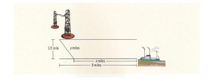

# Project 3 - Statements, Expressions, and Loops

A power station is on one side of a river that is one-half mile wide, and a
factory is eight miles downstream on the other side of the river.  It costs $7
per foot to run power lines over land and $9 per foot to run them under water.
Your objective is to determine the most economical path to lay the power line.
That is, determine how long the power line should run under water and how long
it should run over land to achieve the minimum total cost of laying the power
line.



## Important Links

- Review the [grading rubric](https://shanepanter.com/cs452/grading-rubric.html)

## Objectives

- Creating code that is easier to read and modify/maintain.
  - Creating and using user defined functions.
  - Using constants.
- Formatting output to a standard.
- Use the Pythagorean theorem
- Use loops, branches and expressions

## Task 1 - Write the program

Write a program that prompts the user to enter:

- The distance of the factory downstream on the other side of the river.
- The width of the river.
- The cost of laying the power line over land.
- The cost of laying the power line under water.

The program then determines and outputs the length of the power line that should
run under water and the length that should run over land so that the cost of
constructing the power line is at the minimum.  The program should also output
the total cost of constructing the power line. You can make the following
assumptions:

1. Move down the river in  ¼ mile (1320’) increments when determining the cost
   of laying the cable.
2. The power station and the factory are right next to the river.
3. You can disregard the z axis (the depth of the cable) when determining the
   cost.

Your code should:

- Create user defined functions whenever warranted/possible (remember, if you do
  the identical set of calculations multiple times then you should use
  functions). This project DOES necessitate functions.   Create the following
  functions (at a minimum):
  - computeDiag(double base, double height) - computes the ‘water’ distance ,the
    diagonal of the triangle
  - computeWaterCost(double length, double cost) - computes the water cost
  - computeLandCost(double length, double cost) - computes the land cost
- Use ‘constants’ when warranted.
- Cable length should be displayed in miles to 4 decimal places.
- Dollar amounts should be preceded by a dollar sign (‘$’) to 2 decimal places.

Your output shall:

- List the cable length going over land and its cost with an appropriately
  written prompt that identifies what the length and cost represents.
- List the cable length going across the river and its cost with an
  appropriately written prompt that identifies what the length and cost
  represents.
- List the overall cost to lay the cable with an appropriately written prompt
  that identifies what the cost represents.
- The execution of your program should display the output below (text stated
  should be exact):

```bash
Enter the distance downstream to the factory in miles: 8
Enter the width of the river in miles: .5
Enter the dollar cost per foot to run power over land: 7
Enter the dollar cost per foot to run power under water: 9
Checking distance over water when land distance is 0.00 miles...380901.78
Checking distance over water when land distance is 0.25 miles...378285.66
Checking distance over water when land distance is 0.50 miles...375671.12
Checking distance over water when land distance is 0.75 miles...373058.34
Checking distance over water when land distance is 1.00 miles...370447.49
Checking distance over water when land distance is 1.25 miles...367838.80
Checking distance over water when land distance is 1.50 miles...365232.50
Checking distance over water when land distance is 1.75 miles...362628.88
Checking distance over water when land distance is 2.00 miles...360028.29
Checking distance over water when land distance is 2.25 miles...357431.10
Checking distance over water when land distance is 2.50 miles...354837.78
Checking distance over water when land distance is 2.75 miles...352248.87
Checking distance over water when land distance is 3.00 miles...349665.04
Checking distance over water when land distance is 3.25 miles...347087.08
Checking distance over water when land distance is 3.50 miles...344515.95
Checking distance over water when land distance is 3.75 miles...341952.84
Checking distance over water when land distance is 4.00 miles...339399.24
Checking distance over water when land distance is 4.25 miles...336857.02
Checking distance over water when land distance is 4.50 miles...334328.57
Checking distance over water when land distance is 4.75 miles...331817.00
Checking distance over water when land distance is 5.00 miles...329326.44
Checking distance over water when land distance is 5.25 miles...326862.44
Checking distance over water when land distance is 5.50 miles...324432.70
Checking distance over water when land distance is 5.75 miles...322048.19
Checking distance over water when land distance is 6.00 miles...319724.99
Checking distance over water when land distance is 6.25 miles...317487.71
Checking distance over water when land distance is 6.50 miles...315375.72
Checking distance over water when land distance is 6.75 miles...313455.76
Checking distance over water when land distance is 7.00 miles...311848.98
Checking distance over water when land distance is 7.25 miles...310793.95
Checking distance over water when land distance is 7.50 miles...310801.71
Checking distance over water when land distance is 7.75 miles...313004.49


The most cost effective solution is:

Lay power line across land for 7.2500 miles at a cost of $267960.00.
Lay power line under water for 0.9014 miles at a cost of $42833.95.
The total cost = $310793.95.
```

## Task 2 - Generate Build Files

There are two scripts in the root directory named `clean.sh` and `release.sh`.
One creates a release build to compile your project and the other will delete
all the temporary files that are created during the build process.

Run the `release.sh` script from the terminal to setup your project. Note
that your output will be slightly different than what is shown below because
cmake configures the build system specific to the system that it is running on.

```bash
shane|(master *%=):solution$ ./release.sh
-- The CXX compiler identification is AppleClang 14.0.3.14030022
-- Detecting CXX compiler ABI info
-- Detecting CXX compiler ABI info - done
-- Check for working CXX compiler: /Library/Developer/CommandLineTools/usr/bin/c++ - skipped
-- Detecting CXX compile features
-- Detecting CXX compile features - done
-- Configuring done
-- Generating done
-- Build files have been written to: ...
```

## Task 3 - Compile your code

After you have run `release.sh` you can `cd` into the build directory to compile
and run the program.

```bash
shane|(master *%=):build$ make
[ 50%] Building CXX object src/CMakeFiles/myprogram.dir/solution.cpp.o
[100%] Linking CXX executable ../myprogram
[100%] Built target myprogram
```

If your code that you wrote in task 1 was correct you should see a executable
named `myprogram` that you can now run to see the output. If your program did
not compile you will need to return to task 1 and fix your code and then return
to this task to compile your code again. You only need to run the `release.sh`
script once if you are recompiling you can skip Task 2 above.

## Task 4 - Complete the Retrospective

Once you have completed all the tasks open the file **Retrospective.md** and
complete each section that has a TODO label.

For the **Experience** section you need to detail your experience with this lab.

- Were there any things that you struggled with?
- Were there any parts of this lab that were unclear or poorly specified?
- Were you able to get the entire project done?

For the **Known issues or Bugs** section you need to detail any issues or bugs
that you have in your code. For example maybe your code crashes randomly and you
couldn't figure out why. If your code doesn't have any issues you can simply
write NONE in this section.

For the **Sources used** section you must detail any sources you used outside of
the textbook or course website. If you write NONE in this section it is assumed
that you didn't use google at all. Be safe CITE!

## Task 5 - Add, Commit, Push your code

Once you are finished you need to make sure that you have pushed all your code
to GitHub for grading! You will not be submitting anything to canvas everything
will be submitted through GitHub as demonstrated in class.
